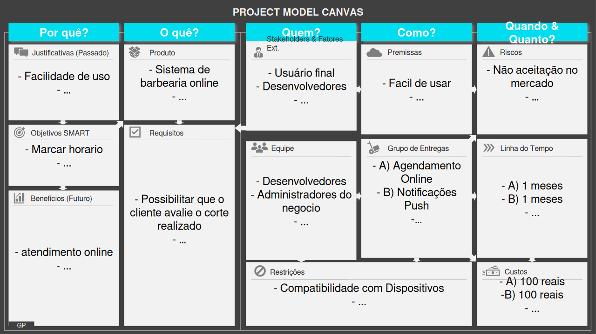
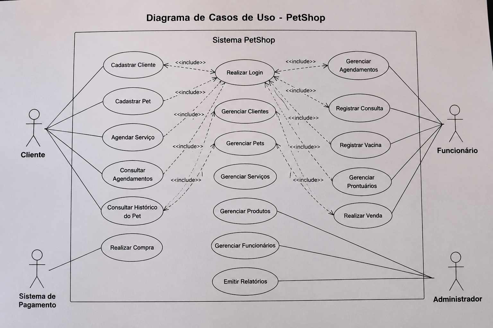
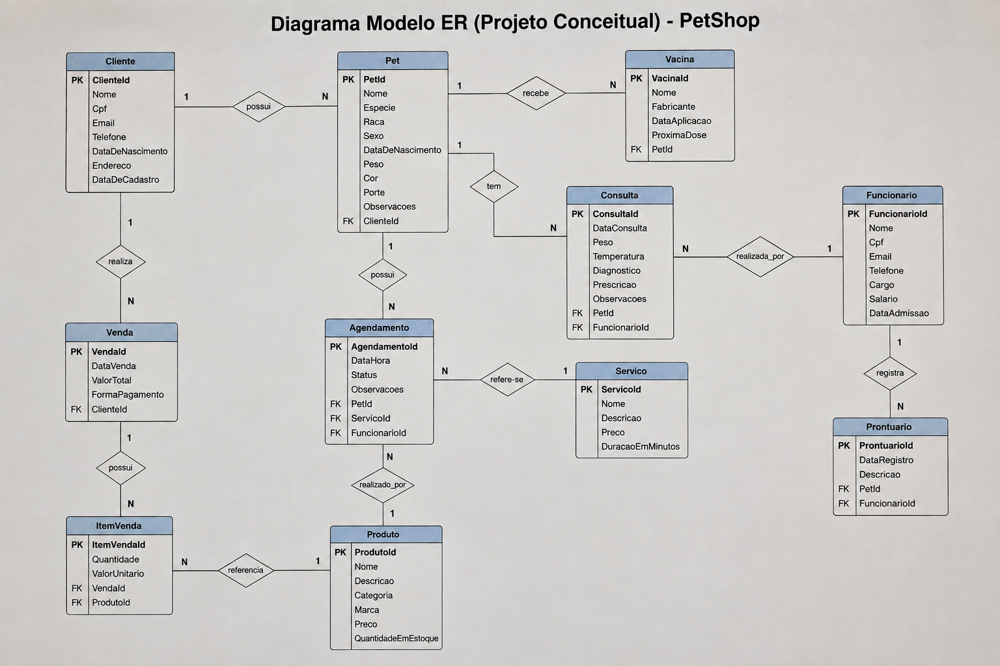

# Especificações do Projeto

Pré-requisitos: <a href="1-Documentação de Contexto.md"> Documentação de Contexto</a>

---

## Visão Geral da Especificação do Projeto

Nesta etapa do projeto de desenvolvimento do sistema para o **PetShoop**, será apresentada a **especificação funcional e estrutural** do sistema. O objetivo é definir com clareza os requisitos, as funcionalidades e os componentes envolvidos no funcionamento do sistema, garantindo que todas as necessidades do negócio sejam devidamente representadas.

### Técnicas e Ferramentas Utilizadas:

1. **Modelo Entidade-Relacionamento (ER)**
   - Ferramenta gráfica para representar a estrutura do banco de dados.
   - Define entidades (ex: Cliente, Pet, Serviço), seus atributos e os relacionamentos entre elas.
   - Utilizada para organizar e visualizar como os dados serão armazenados.

2. **Derivação para Modelo Lógico Relacional**
   - Conversão do Modelo ER para tabelas relacionais (modelo lógico).
   - Define chaves primárias, estrangeiras e integridade referencial.
   - Base para implementação do banco de dados em SGBDs como SQL Server, PostgreSQL ou MySQL.

3. **Casos de Uso**
   - Descrição de funcionalidades sob a perspectiva do usuário (ex: “Agendar banho e tosa”, “Cadastrar pet”).
   - Representa os atores (usuários) e suas interações com o sistema.
   - Utilizado para identificar os requisitos funcionais.

4. **Diagramas UML (Unified Modeling Language)**
   - Diagrama de Casos de Uso: mostra o que o sistema faz do ponto de vista do usuário.
   - Diagrama de Atividades (opcional): mostra o fluxo de ações para processos como agendamento.
   - Diagrama de Classes (opcional): para representar a estrutura da aplicação orientada a objetos.

5. **Ferramentas Utilizadas**
   - **Draw.io / Lucidchart**: para criação de diagramas ER e UML.
   - **SQL Server Management Studio / DBeaver**: para modelagem e implementação do banco de dados.
   - **Figma (opcional)**: para prototipagem de interface do sistema.

---

    
# Personas

Através de pesquisas de campo dentro do público alvo do projeto, foram estipuladas as personas que seguem juntamente de suas histórias de usuário, dando origem aos requisitos funcionais e não funcionais da aplicação.

## Personas

### Leonardo Souza Ferreira

| PERFIL                                                                                                                                                                                   | EXPECTATIVAS                                                                                                                                 | ATIVIDADES                                                                                                                                                                                                                                                                                                                                 |
| ---------------------------------------------------------------------------------------------------------------------------------------------------------------------------------------- | -------------------------------------------------------------------------------------------------------------------------------------------- | ------------------------------------------------------------------------------------------------------------------------------------------------------------------------------------------------------------------------------------------------------------------------------------------------------------------------------------------ |
| Leonardo tem 28 anos, é engenheiro de software e trabalha remotamente. Valoriza a praticidade e otimização do tempo em seu dia a dia. Gosta de tecnologia e está sempre buscando formas de tornar sua rotina mais eficiente. | Ele espera encontrar um serviço rápido e confiável para agendar o cuidado do seu pet online, sem precisar aguardar em longas filas. Quer encontrar uma equipe que entenda as necessidades do seu animal. | Tem uma rotina corrida e não quer perder tempo procurando pet shops ou clínicas. Busca um aplicativo intuitivo para escolher serviços, visualizar histórico e agendar atendimentos conforme sua disponibilidade. |

---

### Marcos Vinícius Oliveira

| PERFIL                                                                                                           | EXPECTATIVAS                                                                                                                                      | ATIVIDADES                                                                                                                                                                                                                                                                           |
| ---------------------------------------------------------------------------------------------------------------- | ------------------------------------------------------------------------------------------------------------------------------------------------- | ------------------------------------------------------------------------------------------------------------------------------------------------------------------------------------------------------------------------------------------------------------------------------------ |
| Marcos tem 35 anos e é gerente comercial. Seu trabalho exige uma apresentação impecável, e ele frequenta o pet shop regularmente para manter a saúde e higiene de seus animais. Prefere atendimento personalizado e está disposto a pagar mais por serviços de qualidade. | Busca um aplicativo que ofereça serviços premium para pets, como atendimento VIP, planos de manutenção e agendamento recorrente para evitar preocupações com marcações de última hora. | Mantém um compromisso com o cuidado dos pets, mas gostaria de mais praticidade no agendamento. Está sempre atento a novidades e promoções para seus animais. |

---

### Diego Santana Ribeiro

| PERFIL                                                                                                           | EXPECTATIVAS                                                                                                                                      | ATIVIDADES                                                                                                                                                                                                                                                                           |
| ---------------------------------------------------------------------------------------------------------------- | ------------------------------------------------------------------------------------------------------------------------------------------------- | ------------------------------------------------------------------------------------------------------------------------------------------------------------------------------------------------------------------------------------------------------------------------------------ |
| Diego tem 22 anos, é estudante universitário e trabalha meio período. Gosta de pets e procura opções acessíveis e rápidas para cuidar dos seus animais. | Ele deseja encontrar serviços de banho, tosa e consulta que possam ser agendados facilmente. Também busca avaliações de outros clientes e promoções para aproveitar descontos. | Usa redes sociais para se inspirar e quer um aplicativo que facilite encontrar serviços para pets e agendar atendimentos rápidos, mesmo de última hora. |

---

# Histórias de Usuários
A partir da compreensão do dia a dia das personas identificadas para o projeto, foram registradas as seguintes histórias de usuários.

| EU COMO... `PERSONA` | QUERO/PRECISO ... `FUNCIONALIDADE`                                                                                          | PARA ... `MOTIVO/VALOR`                                                                                                                                                                                                                                                                                             |
| -------------------- | --------------------------------------------------------------------------------------------------------------------------- | ------------------------------------------------------------------------------------------------------------------------------------------------------------------------------------------------------------------------------------------------------------------------------------------------------------------- |
| Leonardo   | agendar um atendimento para o meu pet online.                                                              |garantir que o cuidado do meu animal ocorra no dia e hora que mais me convém. |
| Marcos   | desejo um aplicativo inovador para encontrar serviços para pets na minha cidade.                                                             |me organizar e cuidar melhor dos meus animais com qualidade. |
| Diego   | visualizar serviços e avaliações de pet shops.                                                             |marcar online com facilidade. |

---
    

##  Arquitetura e Tecnologias Utilizadas

A arquitetura do sistema será baseada no modelo **Cliente-Servidor**, adotando uma abordagem moderna e escalável, que separa a lógica de apresentação (frontend) da lógica de negócios e persistência (backend). Essa separação facilita a manutenção, a escalabilidade e a integração futura com outros serviços.

###  **Backend (Servidor)**

O servidor será responsável por fornecer uma **Web API RESTful**, desenvolvida com a plataforma **.NET**, utilizando a linguagem **C#**. A escolha do .NET se dá por sua robustez, performance, segurança e suporte contínuo da Microsoft, sendo amplamente adotado em projetos de pequeno a grande porte.

- **Framework**: ASP.NET Core (ou .NET Framework, dependendo da necessidade do projeto)
- **Linguagem**: C#
- **Banco de Dados**: SQL Server (pode ser substituído por PostgreSQL ou MySQL, conforme o ambiente)
- **ORM**: Entity Framework Core, para mapeamento objeto-relacional e manipulação de dados de forma mais simples e segura
- **Padrões adotados**:
  - RESTful API
  - Repository Pattern
  - Dependency Injection
  - Camadas separadas (Controller, Service, Repository)

###  **Frontend (Cliente da Aplicação)**

A interface do usuário será construída com **ReactJS**, utilizando componentes web modernos e responsivos para garantir uma boa experiência em desktops e dispositivos móveis.

Essa escolha visa proporcionar uma **experiência fluida e moderna ao usuário**, com reutilização de componentes, facilidade de manutenção e redução no tempo de desenvolvimento.

- **Framework**: ReactJS
- **Linguagem**: JavaScript (ou TypeScript, opcionalmente)
- **Bibliotecas de apoio**:
  - Axios (para chamadas HTTP à API)
  - React Router (para navegação entre páginas)
  - Redux ou Context API (para gerenciamento de estado, se necessário)
  - Styled-components ou Tailwind CSS (para estilização dos componentes)

### ☁️ Integração e Implantação

- **Hospedagem do Backend**: Azure, AWS ou algum provedor com suporte a aplicações .NET
- **Banco de Dados**: pode ser hospedado em nuvem junto ao servidor, com backups automatizados
- **CI/CD**: GitHub Actions, Azure DevOps ou outra pipeline para automatizar testes e deploys
- **Publicação do Frontend**: hospedagem em plataformas web como Vercel, Netlify ou Azure Static Web Apps

---

    
## Project Model Canvas

Colocar a imagem do modelo construído apresentando a proposta de solução.

    
## Requisitos

As tabelas que se seguem apresentam os requisitos funcionais e não funcionais que detalham o escopo do projeto. Para determinar a prioridade de requisitos, aplicar uma técnica de priorização de requisitos e detalhar como a técnica foi aplicada.

### Requisitos Funcionais

|ID    | Descrição do Requisito  | Prioridade |
|------|-----------------------------------------|----|
|RF-001| Permitir que o cliente agende um horário de serviço para seu pet online | ALTA | 
|RF-002| Enviar lembretes automáticos de agendamentos de serviços e consultas para pets | ALTA | 
|RF-003| Possibilitar que o cliente avalie o atendimento prestado ao seu pet | MÉDIA | 
|RF-004| Exibir um catálogo de serviços e produtos para pets | ALTA | 
|RF-005| Fornecer um contato direto com o pet shop ou clínica via chat ou WhatsApp | ALTA | 
|RF-006| Integração ao Google Maps para exibir a localização do estabelecimento | MÉDIA | 
|RF-007| Permitir que atendentes e veterinários gerenciem seus horários de atendimento | ALTA | 
|RF-008| Implementar sistema de confirmação automática de agendamentos | ALTA | 
|RF-009| Oferecer um painel administrativo para controle de agendamentos e vendas | MÉDIA | 
|RF-010| Notificar a equipe sobre novos agendamentos ou cancelamentos | ALTA | 

### Requisitos não Funcionais

|ID     | Descrição do Requisito  |Prioridade |
|-------|-------------------------|----|
|RNF-001| O sistema deve garantir a confirmação instantânea dos agendamentos | ALTA | 
|RNF-002| A interface deve ser simples, intuitiva e visualmente atraente   | ALTA | 
|RNF-003| Deve ser otimizado para dispositivos móveis (Android e iOS) | ALTA | 
|RNF-004| Deve carregar a galeria de estilos rapidamente | MÉDIA | 
|RNF-005| Suportar notificações push para lembretes de agendamento | ALTA | 

## Restrições

O projeto está restrito pelos itens apresentados na tabela a seguir.

|ID| Restrição                                                           |
|--|-------------------------------------------------------              |
|01| O projeto deverá ser entregue até o final do semestre               |
|02| A confirmação automática de agendamentos dependerá de conexão ativa |
|03| O desenvolvimento deve ser feito sem investir em serviços pagos     |

---

    
##  Planejamento do Projeto de TI – Sistema PetShoop

###  Objetivo
Desenvolver um sistema de agendamento e gestão para um pet shop e clínica veterinária, com interface web para clientes e painel administrativo para a equipe.

---

###  Etapas do Projeto e Cronograma

| Etapa                       | Atividades principais                                                                 | Responsável           | Duração estimada |
|----------------------------|----------------------------------------------------------------------------------------|------------------------|------------------|
| **1. Levantamento de Requisitos** | Entrevistas com clientes, donos de pets e equipe, definição das funcionalidades principais         | Analista de Sistemas   | 1 semana         |
| **2. Modelagem e Especificações** | Criação do modelo ER, histórias de usuário, diagrama de casos de uso e arquitetura     | Analista / Arquiteto   | 1 semana         |
| **3. Design da Interface**       | Criação dos protótipos de telas no Figma ou similar                                   | Designer UI/UX         | 1 semana         |
| **4. Desenvolvimento Backend**   | Criação da API com .NET, modelagem do banco, autenticação, endpoints principais       | Desenvolvedor Backend  | 3 semanas        |
| **5. Desenvolvimento Frontend**    | Telas com ReactJS, integração com API, autenticação, agendamento, perfil do pet       | Desenvolvedor Frontend | 3 semanas        |
| **6. Testes e Validações**      | Testes de usabilidade, testes automatizados, correção de bugs                         | QA / Todos os Devs     | 1 semana         |
| **7. Implantação**              | Deploy do backend e frontend em nuvem, publicação da aplicação web                    | DevOps / Equipe Geral  | 1 semana         |
| **8. Treinamento e Suporte**    | Capacitação para equipe e suporte técnico inicial                                     | Analista / Suporte     | Contínuo         |

---

###  Equipe Envolvida

| Função                   | Integrante | Responsabilidades                                                                  |
|------------------------  |---------   |------------------------------------------------------------------------------------|
| **Gerente de Projeto**   |            | Coordena prazos, recursos, reuniões e entregas                                     |
| **Analista de Sistemas** |            | Define os requisitos, desenha as soluções e faz a ponte entre técnico e negócio    |
| **Designer UI/UX**       |            | Cria protótipos e garante boa experiência do usuário                               |
| **Desenvolvedor Backend**| Mailson Silva | Cria e mantém a lógica do sistema e a API de comunicação                           |
| **Desenvolvedor Frontend** |            | Desenvolve a interface web em ReactJS e conecta ao backend                         |
| **Testador (QA)**        | Mailson Silva | Testa funcionalidades, busca bugs e garante a qualidade geral                      |
| **DevOps (opcional)**    | Mailson Silva  | Cuida do deploy, infraestrutura e automações                                       |
| **Suporte Técnico**      |            | Apoia os usuários após a entrega                                                   |

---

    

##  Planejamento de Custos – Projeto de Sistema PetShoop

###  Objetivo
Estimar e controlar os custos relacionados ao desenvolvimento e implantação do sistema de agendamento e gestão para um pet shop, considerando mão de obra, ferramentas e infraestrutura.

---

###  Cronograma de Custos por Etapa

| Etapa do Projeto             | Recursos Utilizados                           | Custo Estimado (R$) | Período         |
|-----------------------------|-----------------------------------------------|----------------------|------------------|
| **1. Levantamento de Requisitos** | Analista de Sistemas (freelancer ou interno)   | R$ 1.200             | Semana 1         |
| **2. Modelagem e Design**         | Designer UI/UX + Analista                    | R$ 1.500             | Semana 2         |
| **3. Desenvolvimento Backend**    | Dev .NET (freelancer ou equipe)              | R$ 3.000             | Semanas 3–4      |
| **4. Desenvolvimento Frontend**     | Dev ReactJS                                 | R$ 3.500             | Semanas 5–7      |
| **5. Infraestrutura e Deploy**    | Hospedagem (Azure ou AWS) + domínio          | R$ 500 (mensal)      | Semana 7         |
| **6. Testes e Correções**         | QA Tester + horas extras devs                | R$ 1.000             | Semana 8         |
| **7. Publicação nas Lojas**       | Google Play (R$ 25 único) / Apple Store (R$ 499 anual) | R$ 524             | Semana 9         |
| **8. Treinamento e Suporte Inicial** | Suporte técnico + treinamento básico       | R$ 800               | Semana 10        |

---

###  Resumo dos Custos Estimados

| Categoria                     | Valor Total (R$) |
|------------------------------|------------------|
| Mão de obra (devs, design, QA) | R$ 10.200        |
| Infraestrutura (1º mês)        | R$ 500           |
| Publicação de app              | R$ 524           |
| Treinamento/Suporte            | R$ 800           |
| **Total Geral Estimado**       | **R$ 12.024**    |

---

    

##  Análise da Situação Atual do Processo de Negócio – Pet Shop

###  Situação Atual (antes da automação)

Muitos pet shops e clínicas veterinárias ainda operam com processos manuais ou pouco informatizados. Os agendamentos e registros são feitos da seguinte forma:

- **Agendamento por telefone, WhatsApp ou presencialmente**  
  → Sem controle centralizado; risco de horários duplicados ou esquecidos.

- **Registro de clientes e pets feito em papel ou anotações informais**  
  → Difícil acompanhar o histórico de vacinas, serviços e preferências do animal.

- **Gerenciamento de horários de veterinários e atendentes manual (caderneta ou planilha)**  
  → Falta de visibilidade em tempo real, risco de sobreposição.

- **Controle de estoque e serviços feito no final do dia**  
  → Sujeito a erros e sem relatórios automatizados.

- **Divulgação do pet shop feita em redes sociais, sem integração com sistema de agendamento**  
  → O cliente vê a oferta, mas precisa entrar em contato manualmente.

---

### ⚙️ Possibilidades de Automação

Abaixo, as áreas que podem ser automatizadas com o sistema proposto:

| Área de Negócio                | Solução de Automação                                             | Benefícios Esperados                                  |
|-------------------------------|-------------------------------------------------------------------|--------------------------------------------------------|
| **Agendamentos**              | Interface web com escolha de serviço, pet e horário disponível     | Elimina conflitos de agenda, reduz chamadas/espera     |
| **Cadastro de Clientes e Pets**      | Registro automático no sistema com histórico                     | Facilita fidelização, promoções e comunicação          |
| **Agenda da Equipe**        | Painel digital com horários, serviços e nome do cliente           | Organização pessoal, ganho de produtividade            |
| **Produtos e Serviços**      | Relatórios de vendas e integração com métodos de pagamento         | Controle financeiro mais claro e seguro                |
| **Promoções e Notificações**  | Envio de lembretes e promoções por e-mail ou push notification    | Aumenta a fidelização e reduz faltas                   |

---

###  Avaliação de Impacto

| Impacto                      | Antes da Automação                       | Após a Automação                              |
|-----------------------------|------------------------------------------|------------------------------------------------|
| **Eficiência Operacional**  | Lenta, propensa a erros manuais          | Automatizada, com menos retrabalho             |
| **Satisfação do Cliente**   | Depende de atendimento humano direto     | Cliente escolhe horários de forma autônoma     |
| **Organização Interna**     | Pouco controle de agenda e histórico     | Agenda e dados centralizados e acessíveis      |
| **Análise de Dados**        | Inexistente (ou manual)                  | Relatórios automáticos e insights gerenciais   |
| **Escalabilidade**          | Limitada à capacidade de gestão manual   | Sistema permite expansão sem perder controle   |

---

###  Conclusão

Automatizar o processo do pet shop com um sistema digital **traz melhorias diretas na organização, produtividade e experiência do cliente**, além de permitir crescimento e controle com mais facilidade. É um investimento que impacta tanto a rotina operacional quanto as decisões estratégicas do negócio.

---

    
## Diagrama de Casos de Uso

---
 

    
## Modelo ER (Projeto Conceitual)

    
## Projeto da Base de Dados - Sistema PetShoop

# Introdução

Este projeto descreve a base de dados relacional para um sistema de agendamento e gestão de serviços para um pet shop. O modelo é derivado de um diagrama ER (Entidade-Relacionamento) e contempla as entidades, atributos, chaves primárias e estrangeiras, e todas as restrições de integridade.

---

## 🧱 Estrutura Relacional

Abaixo estão descritas as tabelas do banco de dados, com seus respectivos campos, tipos de dados e restrições.

---

### 🔹 Tabela: `Cliente`

Contém informações dos donos dos pets que realizam agendamentos ou compras.

| Campo            | Tipo          | Restrições              |
|------------------|---------------|--------------------------|
| `cliente_id`     | UNIQUEIDENTIFIER | PRIMARY KEY           |
| `nome`           | VARCHAR(100)  | NOT NULL                |
| `email`          | VARCHAR(100)  | NOT NULL, UNIQUE        |
| `telefone`       | VARCHAR(20)   |                         |
| `endereco`       | VARCHAR(200)  |                         |
| `data_nascimento`| DATE          |                         |

---

### 🔹 Tabela: `Pet`

Contém as informações dos animais de estimação dos clientes.

| Campo            | Tipo          | Restrições              |
|------------------|---------------|--------------------------|
| `pet_id`         | UNIQUEIDENTIFIER | PRIMARY KEY           |
| `nome`           | VARCHAR(100)  | NOT NULL                |
| `especie`        | VARCHAR(50)   |                         |
| `raca`           | VARCHAR(50)   |                         |
| `sexo`           | VARCHAR(20)   |                         |
| `data_nascimento`| DATE          |                         |
| `peso`           | DECIMAL(5,2)  |                         |
| `cliente_id`     | UNIQUEIDENTIFIER | FOREIGN KEY → Cliente(cliente_id) |

---

### 🔹 Tabela: `Servico`

Representa os serviços oferecidos pelo pet shop ou clínica.

| Campo           | Tipo          | Restrições                       |
|-----------------|---------------|----------------------------------|
| `servico_id`    | UNIQUEIDENTIFIER | PRIMARY KEY                   |
| `nome`          | VARCHAR(100)  | NOT NULL                        |
| `descricao`     | TEXT          |                                  |
| `duracao_minutos` | INT         |                                  |
| `preco`         | DECIMAL(10,2) | NOT NULL                         |

---

### 🔹 Tabela: `Agendamento`

Registra os horários agendados para os pets.

| Campo               | Tipo          | Restrições                                     |
|---------------------|---------------|------------------------------------------------|
| `agendamento_id`    | UNIQUEIDENTIFIER | PRIMARY KEY                               |
| `data`              | DATE          | NOT NULL                                      |
| `hora`              | TIME          | NOT NULL                                      |
| `status`            | VARCHAR(50)   | NOT NULL                                      |
| `lembrete_enviado`  | BIT           |                                              |
| `cliente_id`        | UNIQUEIDENTIFIER | FOREIGN KEY → Cliente(cliente_id)          |
| `pet_id`            | UNIQUEIDENTIFIER | FOREIGN KEY → Pet(pet_id)                  |
| `servico_id`        | UNIQUEIDENTIFIER | FOREIGN KEY → Servico(servico_id)          |

---

### 🔹 Tabela: `Produto`

Registra os produtos disponíveis para venda no pet shop.

| Campo           | Tipo          | Restrições                       |
|-----------------|---------------|----------------------------------|
| `produto_id`    | UNIQUEIDENTIFIER | PRIMARY KEY                   |
| `nome`          | VARCHAR(100)  | NOT NULL                        |
| `descricao`     | TEXT          |                                  |
| `preco`         | DECIMAL(10,2) | NOT NULL                         |
| `estoque`       | INT           | NOT NULL                         |

---

### 🔹 Tabela: `Venda`

Registra as vendas de produtos e serviços realizadas no pet shop.

| Campo              | Tipo          | Restrições                                 |
|--------------------|---------------|--------------------------------------------|
| `venda_id`         | UNIQUEIDENTIFIER | PRIMARY KEY                             |
| `data`             | DATE          | NOT NULL                                  |
| `valor_total`      | DECIMAL(10,2) | NOT NULL                                  |
| `cliente_id`       | UNIQUEIDENTIFIER | FOREIGN KEY → Cliente(cliente_id)        |

---

### 🔹 Tabela: `Avaliacao`

Contém comentários e avaliações do cliente sobre o atendimento.

| Campo              | Tipo        | Restrições                                 |
|--------------------|-------------|--------------------------------------------|
| `avaliacao_id`     | UNIQUEIDENTIFIER | PRIMARY KEY                            |
| `nota`             | INT         |                                            |
| `comentario`       | TEXT        |                                            |
| `data`             | DATE        |                                            |
| `agendamento_id`   | UNIQUEIDENTIFIER | FOREIGN KEY → Agendamento(agendamento_id) |

---

## 🔐 Restrições de Integridade

- **Chaves primárias** garantem a unicidade dos registros.
- **Chaves estrangeiras** asseguram integridade entre relacionamentos.
- **Relacionamentos principais**:
  - Cliente → Pet (1:N)
  - Cliente → Agendamento (1:N)
  - Pet → Agendamento (1:N)
  - Servico → Agendamento (1:N)
  - Agendamento → Avaliacao (1:1)
  - Cliente → Venda (1:N)

---

## 💡 Regras de Negócio

- Cada cliente pode ter múltiplos pets cadastrados.
- Cada pet pode ter múltiplos agendamentos.
- O sistema deve registrar histórico de serviços e avaliações por agendamento.
- Produtos podem ser vendidos separadamente ou como parte de um atendimento.
- A equipe deve poder consultar o histórico completo do cliente e do pet.

---

## 🔄 Possibilidades de Expansão

- Histórico de vacinas e visitas ao veterinário.
- Cadastro de planos de assinatura para banho e tosa.
- Integração com gateways de pagamento online.
- Relatórios de estoque e vendas por período.
- Notificações por e-mail ou WhatsApp.

---

## 🛠️ Tecnologias Recomendadas

- **Banco de Dados**: SQL Server ou PostgreSQL
- **Backend**: ASP.NET Core (.NET)
- **Frontend**: ReactJS
- **ORM**: Entity Framework Core

---

## 📌 Conclusão

Este projeto tem como objetivo geral desenvolver uma estrutura de software e banco de dados que ofereça suporte a um sistema de agendamento e gestão para pet shops e clínicas veterinárias. A modelagem proposta assegura a integridade dos dados através de chaves primárias e estrangeiras, define claramente os relacionamentos entre as entidades e permite futuras expansões, como pagamentos online e notificações automáticas.

Trata-se de uma base sólida, escalável e aderente a boas práticas de modelagem, apta a ser implementada em sistemas reais voltados ao setor de serviços para pets.

