# Projeto de Interface

Pré-requisitos: <a href="03-Projeto de Interface.md"> Documentação de Especificação</a>

Visão geral da interação do usuário com as funcionalidades que fazem parte do sistema sociotécnico (protótipo de telas).

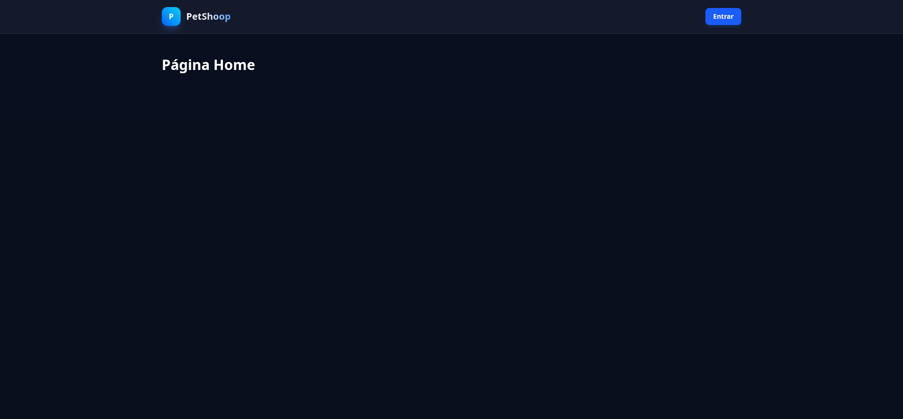

 Tela Inicial do Cliente. 

  

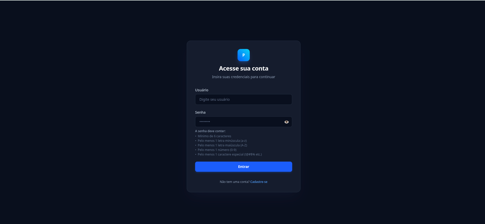

 Tela de login. 

  

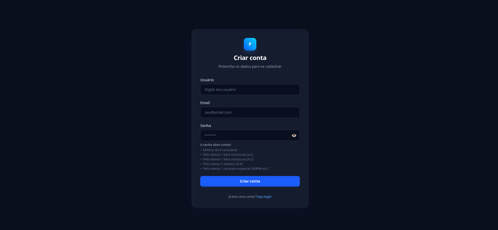

 Tela Cadastro. 

  

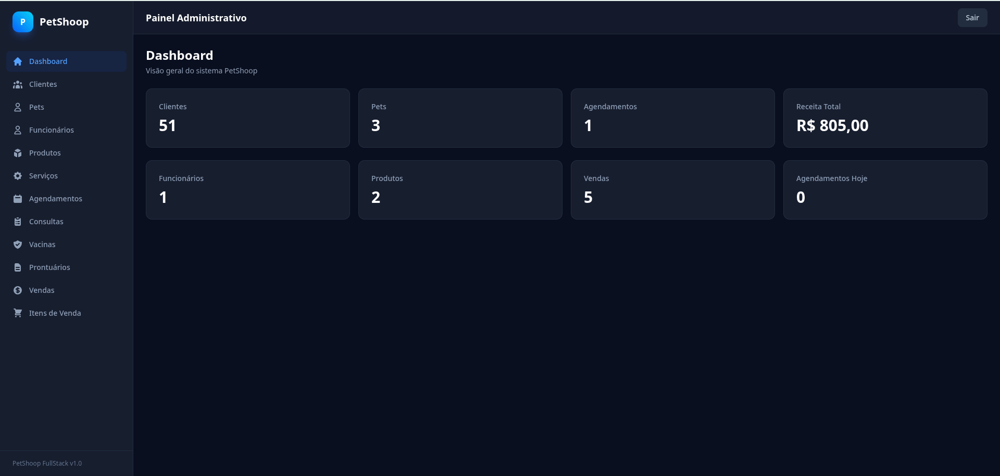

 Tela dahsboard com visão geral. 

  

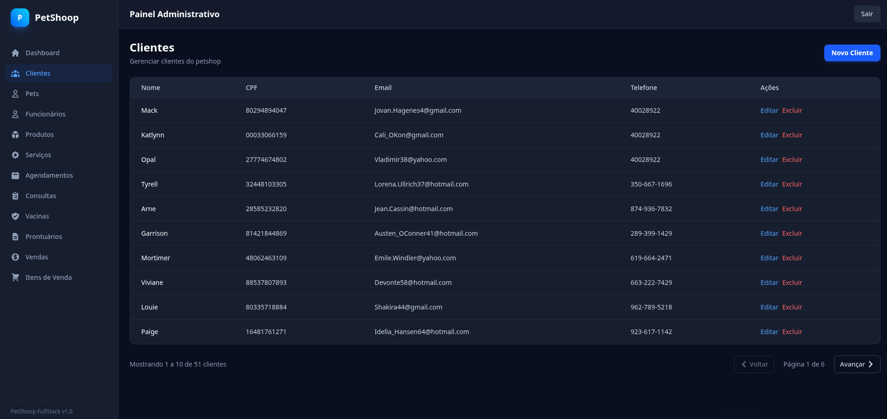

 Tela cadastro de clientes com paginação. 

  

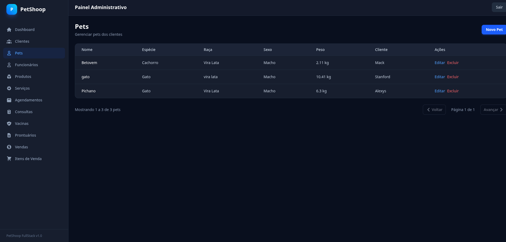

 Tela cadastro de pets com paginação. 

  

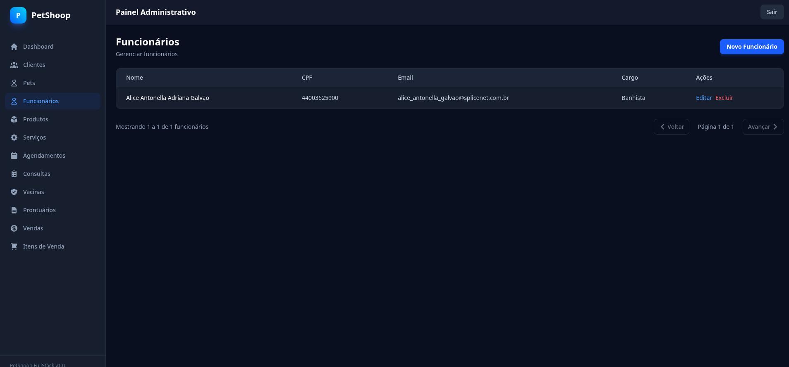

 Tela para cadastro de funcionario. 

  

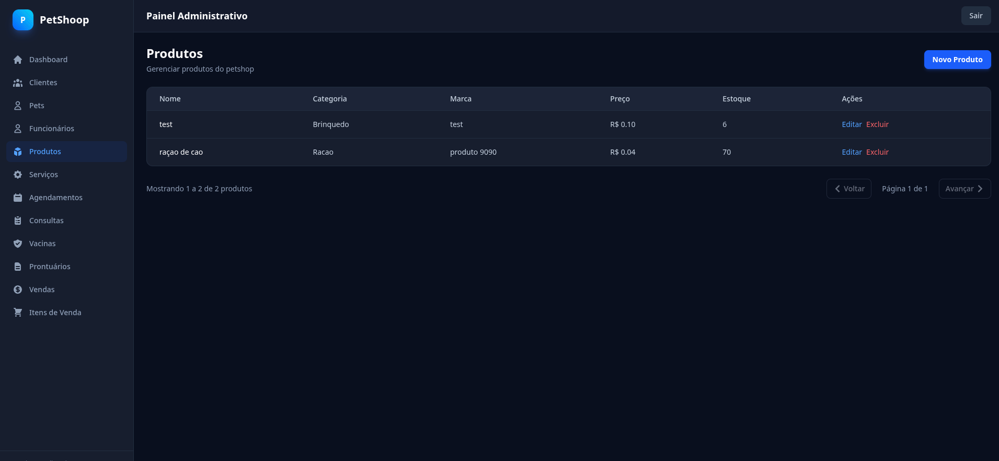

 Tela cadastro de produtos. 

  

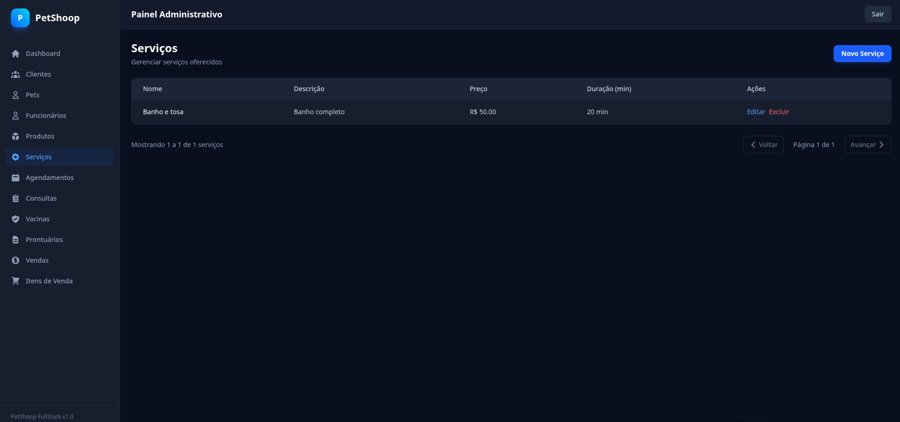

 Tela cadastro de serviços. 

  

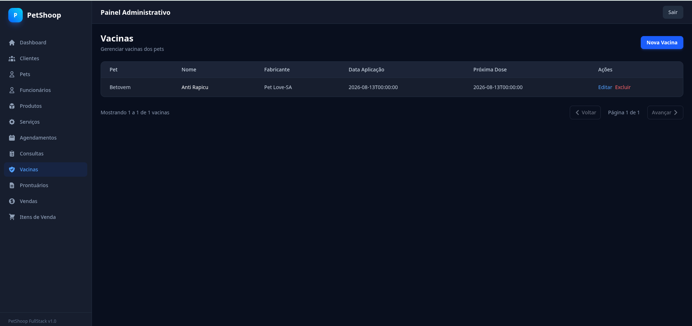

 Tela para vacinas. 

  

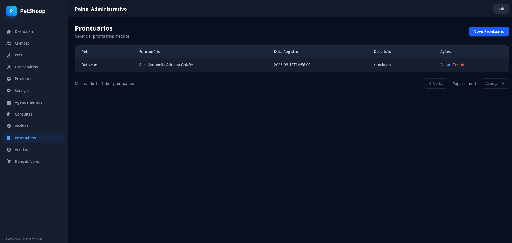

 Tela de prontuarios. 

  

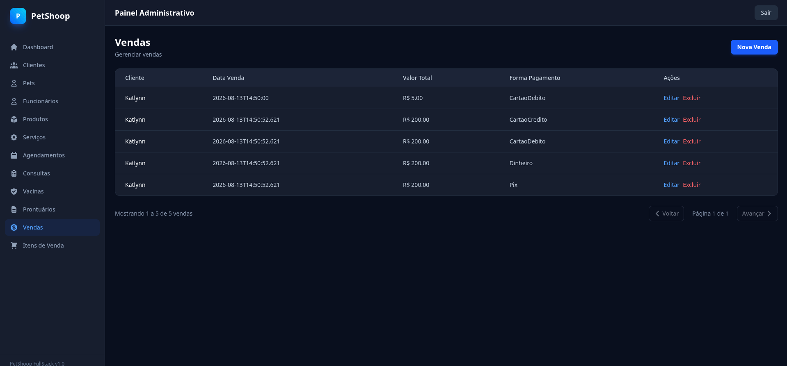

 Tela de vendas. 

  

 Tela de items que foi vendidos.  

