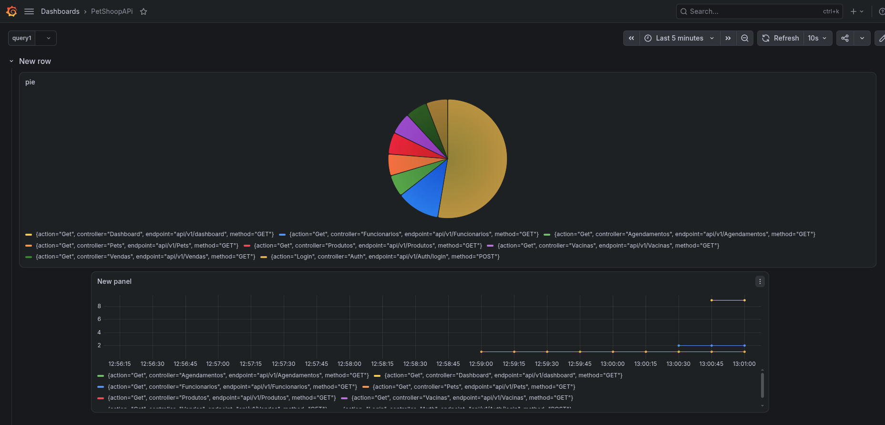

# BackEnd
### Alguns padrões de projeto usados na construção do backend.
<br>


## Padrão assíncrono.

O padrão assíncrono em uma API .NET (como no ASP.NET Core) refere-se ao uso de programação assíncrona para lidar com operações que podem levar tempo — como chamadas de banco de dados, acesso a arquivos ou chamadas HTTP externas — sem bloquear a thread do servidor que está processando a requisição.

## Padrão Repository  Patthern.
Em .NET (C#), Repository Pattern é um padrão de projeto (design pattern) usado para isolar a lógica que acessa dados da lógica de negócios da aplicação. Ele fornece uma abstração entre a camada de acesso a dados (como Entity Framework, Dapper, ADO.NET) e o restante da aplicação.

Objetivo principal:
Centralizar o acesso a dados de forma que o restante do código não precise saber como os dados são acessados, apenas que eles estão sendo acessados por meio de uma interface bem definida.

## Padrão DTOS.
Em .NET (e em outras linguagens), DTO significa Data Transfer Object — ou em português, Objeto de Transferência de Dados. É um padrão usado para transportar dados entre camadas da aplicação, sem expor diretamente as entidades do domínio (como as do Entity Framework).

Objetivo principal:
Evitar expor entidades diretamente (por exemplo, as do banco de dados) para outras camadas, como a API ou UI.

Personalizar os dados enviados ou recebidos, enviando apenas o que é necessário.

Melhorar a segurança, desempenho e controle sobre os dados trafegados.

## Padrão Unit of Work.

Em .NET, o Unit of Work (UoW) é um padrão de projeto que tem como objetivo coordenar a escrita de várias alterações em um banco de dados como uma única transação.

## Arquitetura em Camadas

A solução .NET 10 é dividida em 5 projetos com responsabilidades bem separadas (Clean Architecture / DDD):

| Camada | Projeto | Responsabilidade |
|---|---|---|
| **Domain** | `PetShoop.Domain` | Entidades de domínio (`Cliente`, `Pet`, `Agendamento`, etc.), interfaces de repositório, validações, paginação. Sem dependências de infraestrutura. |
| **Application** | `PetShoop.Application` | Casos de uso, interfaces (`IClienteService`, etc.), DTOs, mapeamentos. Regras de negócio. |
| **Infrastructure** | `PetShoop.Infrastructure` | Entity Framework `AppDbContext`, repositórios concretos, ASP.NET Identity (`ApplicationUser`, `AuthenticateService`, `TokenService`), configurações de entidades, health checks, migrações. |
| **CrossCutting** | `PetShoop.CrossCutting` | Injeção de dependência estática (`DependencyInjectionAPI`, `DependencyInjectionJWT`), configurações de CORS, rate limiter, Swagger, paginação. |
| **API** | `PetShoop.API` | ASP.NET Core: controllers, middleware de exceção, pipeline HTTP (autenticação JWT, Prometheus metrics, health checks). |

### Injeção de Dependência (`Program.cs`)

csharp
builder.Services.AddInfrastructureAPI(builder.Configuration);  // EF + repos + Identity
builder.Services.AddJwtConfiguration(builder.Configuration);     // JWT bearer
builder.Services.AddInfrastructureSwagger(builder.Configuration);
builder.Services.AddInfrastructureRateLimiter(builder.Configuration);
builder.Services.AddInfrastructureCors(builder.Configuration);

### Configuração do Banco de Dados

O `AppDbContext` herda de `IdentityDbContext` e é configurado com SQL Server em `DependencyInjectionAPI.cs:26-34`:

csharp
services.AddDbContext<AppDbContext>(options =>
    options.UseSqlServer(
        configuration.GetConnectionString("DefaultConnection"),
        b => b migrationsAssembly(typeof(AppDb Context).Assembly.FullName)
    )
);

### Configuração do JWT

A assinatura de tokens usa `HmacSha256` com a `SecretKey` da seção `Jwt` (`DependencyInjectionJWT.cs:17` e `TokenService.cs:27`).

# Configuração de Strings de Conexão e JWT

Os valores sensíveis **não devem** ser commitados no repositório. No `appsettings.json` a `ConnectionStrings:DefaultConnection` e `Jwt:SecretKey` estão vazias e devem ser preenchidas em tempo de execução.

O ASP.NET Core lê automaticamente variáveis de ambiente com `__` (dois underscores) para representar aninhamento em JSON, sobrescrevendo os valores do `appsettings.json`.

### Via variáveis de ambiente no `.bashrc`

---

Adicione as seguintes linhas ao seu `.bashrc`:

```bash 
export ConnectionStrings__DefaultConnection="Server=127.0.0.1;Database=clearArchitecture;User=sa;Password=SuaSenhaSQLServe;TrustServerCertificate=True;"
```

```bash 
export Jwt__SecretKey="Sua CHave Secreta JWT"
```

---

Recarregue o `.bashrc` com `source ~/.bashrc` (ou abra um novo terminal) antes de rodar a API.

### Observações

- A variável `Jwt__SecretKey` sobrescreve apenas `Jwt:SecretKey`. `Issuer`, `Audience` e `ExpireMinutes` seguem usando o `appsettings.json`.
- A `ConnectionStrings__DefaultConnection` sobrescreve `ConnectionStrings:DefaultConnection`.
- A `Password` contém caracteres especiais (`@#$`). Use aspas duplas no `.bashrc` ou, preferencialmente, um arquivo `.env` listado no `.gitignore` para evitar problemas de interpretção pelo shell.
- Em produção, use mecanismos de segredo (Docker secrets, Kubernetes Secrets, Key Vault, etc.) em vez de variáveis de ambiente no `.bashrc`.

# Instruções de utilização do BackEnd

Deve ter o Dotnet SDK 10 instalado.
Entre na pasta backend

```bash
dotnet run  --project  PetShoop.API
```
Executar os testes unitários digite.
```bash
dotnet test
```


<br><br><br><br>
<br><br><br><br>


# ver na Telemetria

### instalar o grafana
```bash
sudo pacman -S grafana
```

iniciar serviço
```bash
sudo systemctl start grafana
```
### instala o prometheus

https://prometheus.io/download/

depois de extrair o prometheus var em prometheus.yml e edite cole isso.

```yml
global:
  scrape_interval: 15s
  evaluation_interval: 15s

alerting:
  alertmanagers:
    - static_configs:
        - targets:
          # - alertmanager:9093

rule_files:
  # - "first_rules.yml"
  # - "second_rules.yml"

scrape_configs:
  - job_name: "petshoop-api"
    static_configs:
      - targets: ["localhost:5100"]

  - job_name: "prometheus"
    static_configs:
      - targets: ["localhost:9090"]
        labels:
          app: "prometheus"
    scrape_native_histograms: true
```


#### Inicie o Prometheus apontando para o arquivo
```bash
./prometheus --config.file=prometheus.yml
```

agora adicione graficos no grafena e coloque a telemetria. `http_request_duration_seconds_count`

---

Grafana: http://localhost:3000

Prometheus: http://localhost:9090

---


<br><br><br><br>
